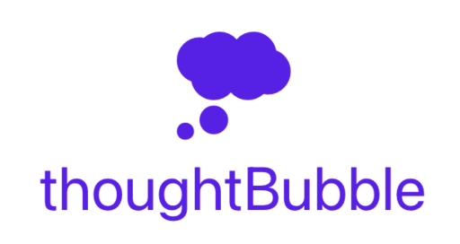

<div align="center"></img></div>

# thoughtBubble (VSCode extension)

*bubble your thoughts together by syncing them between your phone and code editor*

for a more indepth introduction as well as a demo video, visit the [thoughtBubble README](https://github.com/lukehatcher/thoughtBubble/blob/master/README.md)

## Features

open your project thoughts in a new tab
* CMD + SHIFT + P > "see todos"

add highlighted code/text to project
* (highlight text/code) > CMD + SHIFT + P > "+ todo" > (select project from dropdown)

## Requirements

Need the [thoughtBubble](https://github.com/lukehatcher/thoughtBubble) API up and running before cloning the extension.

```
git clone https://github.com/lukehatcher/thoughtBubble-vscode-extension.git && cd thoughtBubble-vscode-extension
```
Finally press `F5` to boot up a VSCode dev enviroment and run the feature commands listed above.

## Extension Settings

WIP

## Known Issues

WIP

## Release Notes

WIP

### 1.0.0

Initial release of ...

### 1.0.1

Fixed issue #.

### 1.1.0

Added features X, Y, and Z.

-----------------------------------------------------------------------------------------------------------