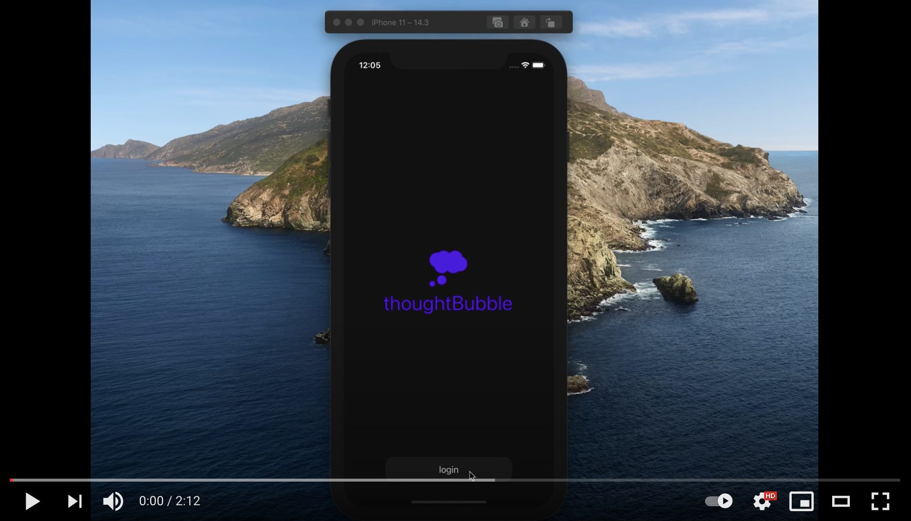

</img>

# thoughtBubble

_bubble your thoughts together by syncing them between your phone and code editor_

## demo video

## monorepo structure

| sub directory                                                                                                  |           stack           |
| :------------------------------------------------------------------------------------------------------------- | :-----------------------: |
| [thoughtbubble-api](https://github.com/lukehatcher/thoughtBubble-monorepo/tree/master/thoughtbubble-api2)      | Node/Express/Postgres API |
| [thoughtbubble-mobile](https://github.com/lukehatcher/thoughtBubble-monorepo/tree/master/thoughtbubble-mobile) |  React Native mobile app  |
| [thoughtbubble-vscode](https://github.com/lukehatcher/thoughtBubble-monorepo/tree/master/thoughtbubble-vscode) | React.js VSCode extension |

## background & tech stack

ThoughtBubble (mobile) is an React Native/Redux/TypeScript application. It pairs with the [ThoughtBubble (VSCode extension)](https://github.com/lukehatcher/thoughtBubble-vscode-extension) in order to sync and display your thoughts on both the mobile and desktop applications. The API is built using Node.js/Express.js/MongoDB and safely typed with TypeScript <3.

## inspiration

Away from your computer and thinking about that one pesky bug or a new feature? Put a note in the thoughtBubble app and have it waiting for you directly in your code editor when you return to your computer.

I built this project to help better centralize my code related thoughts for projects I was working on. Rather than having these thought and ideas scattered across varios slack messages, txt files, code comments, google docs, smartphone notes etc... this allows me to bubble them all together in a simplified ecosystem.

## note on previous app iterations

The initial MVP version of the mobile application was built in a hackathon style without much of its current tech. You can see that archived version [here](https://github.com/lukehatcher/vscode-ios-todos) or the video [here](https://www.youtube.com/watch?v=Qmo6s5LgVo4).
