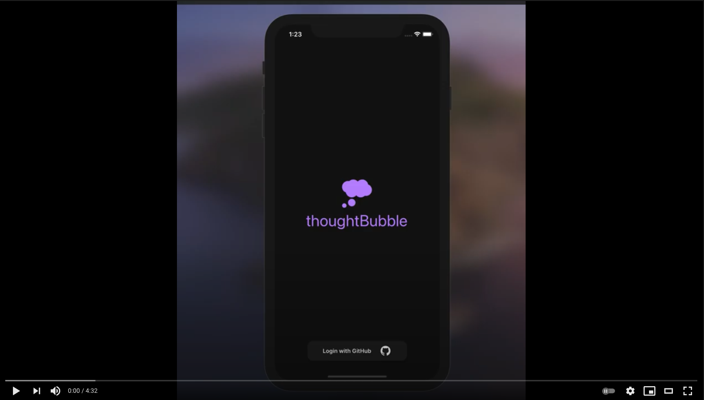

</img>

<h1 align="center"><strong>thoughtBubble</strong></h1>
<h4 align="center">bubble your thoughts together by syncing them between your phone and code editor</h4>

## demo video

## monorepo structure

| sub directory                                                                                                  |           stack           |
| :------------------------------------------------------------------------------------------------------------- | :-----------------------: |
| [thoughtbubble-api](https://github.com/lukehatcher/thoughtBubble-monorepo/tree/master/thoughtbubble-api)       | Node/Express/Postgres API |
| [thoughtbubble-mobile](https://github.com/lukehatcher/thoughtBubble-monorepo/tree/master/thoughtbubble-mobile) |  React Native mobile app  |
| [thoughtbubble-vscode](https://github.com/lukehatcher/thoughtBubble-monorepo/tree/master/thoughtbubble-vscode) | React.js VSCode extension |

## background & tech stack

ThoughtBubble (mobile) is an React Native/Redux/TS application. It pairs with the [ThoughtBubble (VSCode extension)](https://github.com/lukehatcher/thoughtBubble-vscode-extension) in order to sync and display your thoughts on both the mobile and desktop applications. The API is built with Node.js/TS/Express.js/PostgreSQL/.

## inspiration

I built this project to help better centralize my code related thoughts for while I was away from my computer. Normally when I was out running errands and happened to think of a valuble idea, bug fix, etc..., I would either Slack myself, iMessage myself, or throw it in the iOS Notes app and forget about it. The problem was when I got back to my computer, I had to remember that I even put those ideas there, fetch my phone, maybe transcribe my notes to somewhere more permanentm keep referencing them to the side etc. It was not seamless. My solution was to have any of my code related thoughs while away from the computer show up **directly** in my editor when I returned to my desk. This completly removed any middle man and allowed those thoughts to be saved in the one place they matter most, the code editor.

## current project state

Mobile app has about 95% of its necessary features and I have just started shifting my time more towards the VSCode client to catch it up (6/15/21).

## roadmap

## contributions

project will be open to contributions some day, code base needs some restructuring first and some core features still need implementing on the vscode desktop client
